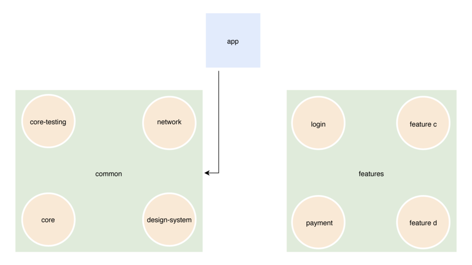
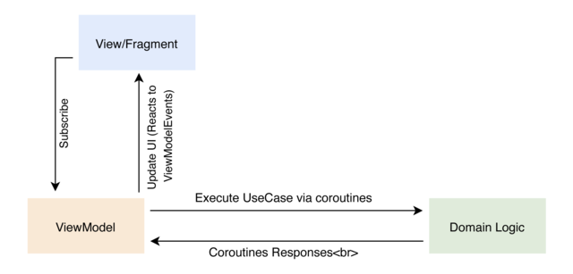
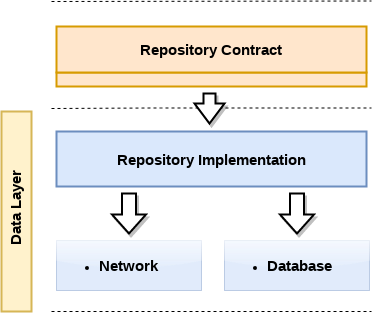

## Getting started
This project uses some architectural concepts to decouple the search logic from the UI logic on different portals
 

## Check the development steps on Trello
 [Trello Kanban Board](https://trello.com/b/Ow7bxJsB/zaap)

## Code Walkthrough

The code is organized using a Clean Architecture with MVVM architecture for the presentation layer. The implementation was heavily based
on the articles and projects of Fernando Cejas:
 * Article: https://fernandocejas.com/2014/09/03/architecting-android-the-clean-way/
 * Project: https://github.com/android10/Android-CleanArchitecture
 * Project: https://github.com/android10/Android-CleanArchitecture-Kotlin

## Multi Module Project Structure
The multi module project structure its being used to de-couple the main app of its features.
Also make it easier to separate feature parts of the application from the design-system.

## Clean Architecture

### ----------------------------------------------------------------------------------------------

## Android 3 Layers Architecture

### ----------------------------------------------------------------------------------------------

## UI Layer: MVVM

### ----------------------------------------------------------------------------------------------

## Data Layer: Repository

## Technologies - [Dependencies.kt](buildSrc/src/main/java/Dependencies.kt) file
* Kotlin - As main language
* Coroutines - To write asynchronous code
* Koin - As Dependency Injection Framework
* Retrofit - For API calls
* Lifecycle ViewModel - To preserve the view model alive through android configuration changes.
* Google Paging Library
* CI configuration with Github Actions + Fastlane

## Junit Tests & Instrumentation
* Mockk library to mock junit tests

### ----------------------------------------------------------------------------------------------

## Local Development
Here are some useful Gradle/adb commands for executing this example:

* `./gradlew assembleDebug` - Builds the debug apk.
* `./gradlew detekt` - Execute the checkstyle task to verify code style.

## Decisions

### Why MVVM?

As alternative to MVP, MVVM takes advantage of the reactive programming to decrease the coupling between the presentation
and the business layer. In that case the same viewModel could be used in many screens.
Check this presentation I´ve made about it some time ago:
[MVVM - Presentation](https://docs.google.com/presentation/d/1NspsJ7r8qn7x7RMFNGNiFSrDhX2qBV59w5fAAUxi_Fs/edit?usp=sharing)

### Do I like tests?

Yes, thats why that architecture was chosen in the first place. But given the time I had to make the whole project, I´ve made only a few tests(junit).

### And Instrumentation tests?
Because every implementation is made using interfaces, its easy to create the inversion of control.

### Next steps
I would like to change the logic for the search using a library with evaluation of expressions and logic operations like and/or etc
I´ve made the first step to that on the operations library inside the project, but given the time I had to make the project, the library its not being used yet because
its needed a expression evaluation logic to use those operations and that would take more time.
